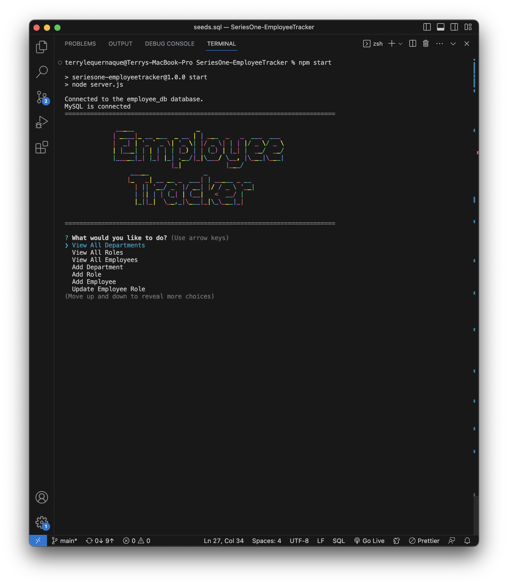
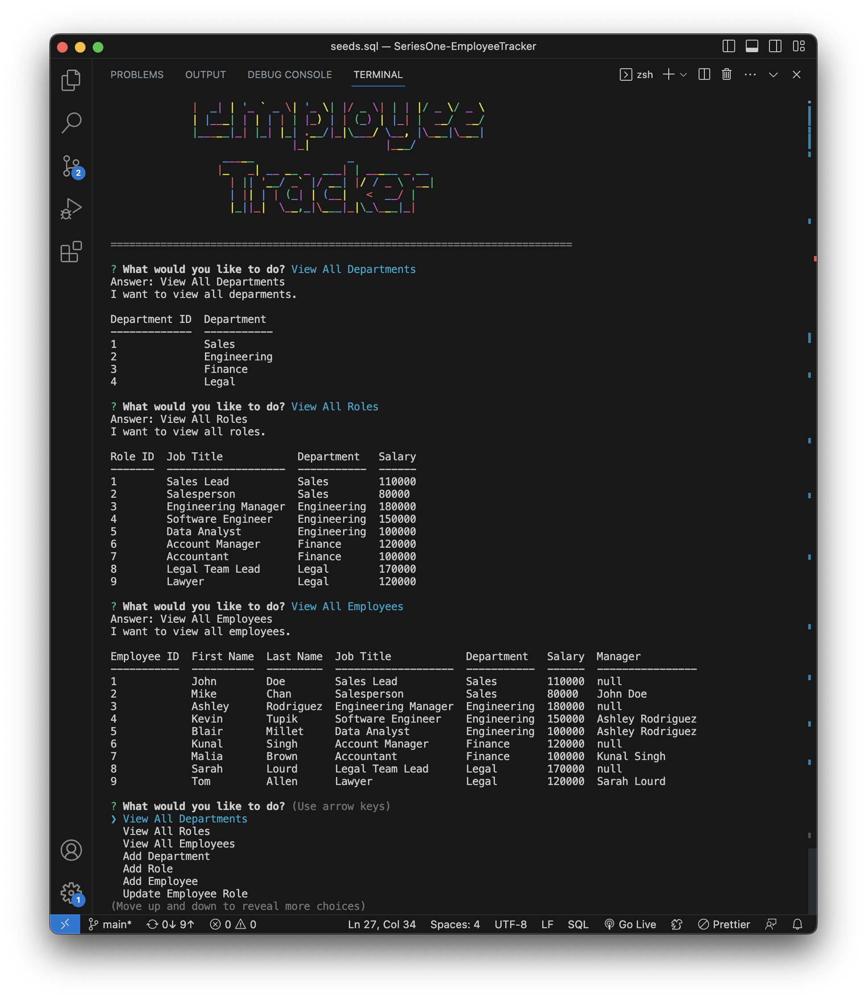

# SeriesOne-EmployeeTracker

## Description
This application is a backend solution for managing a company's employees using node.js, inquirer, and MySQL. The interface functions as a Content Management System (CMS) for non-developers to easily view and interact with information stored in the database from the terminal.

## Table of Contents
- [Installation](#installation)
- [Usage](#usage)
- [Link](#link)
- [Screenshots](#screenshots)
- [Technologies](#technologies)
- [License](#license)
- [Credits](#credits)
- [Contact / Questions](#contact--questions)

## Installation
A. Just to run the application: 
1. Clone the repo down onto your local machine
2. Open the project and make sure your terminal is in the project folder
3. Run an npm i in the CLI to ensure you have the necessary packages installed 

B. To make any edits on the backend before initializing: 
1. Log in to MySQL by using the command: mysql -u root -p
    - When prompted, enter your password for MySQL
2. SHOW DATABASES; --> will show all of your MySQL databases; USE employees_db (this database)
3. In Mysql command: source db/schema.sql and source db/seeds.sql to update your changes before running the app

## Usage (Instructions/How-To Use)
To use this application, go through the necessary installation requirements (installation procees A, listed above, is required). Once completed, use the terminal to initialize the application; command: npm start (or node server).  
Follow the prompts and when finished, choose the end option to quit the app. 

## Link
[Click Here](https://drive.google.com/file/d/16VzeqPHDV4Mi03BxPJA6nhm6lFIM0rKS/view) to go to the video link.

## Screenshots
Intro Prompt:   
  
View all Departments, Roles, Employees:   

## Technologies
JavaScript, Node.js, MySQL

## License
This project is licensed under the MIT license. For more information about this license and what it entails, visit the MIT website <a href="https://opensource.org/licenses/MIT">here</a>

## Credits
Blair Millet and Christina Hall. 

## Contact / Questions
  If you liked this project and want to see more, feel free to check out my other repos [here](https://github.com/tlequernaque).  
  For any questions or inquiries, you can reach me at t.lequernaque@yahoo.com for further information.